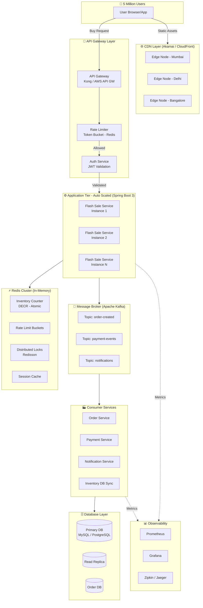
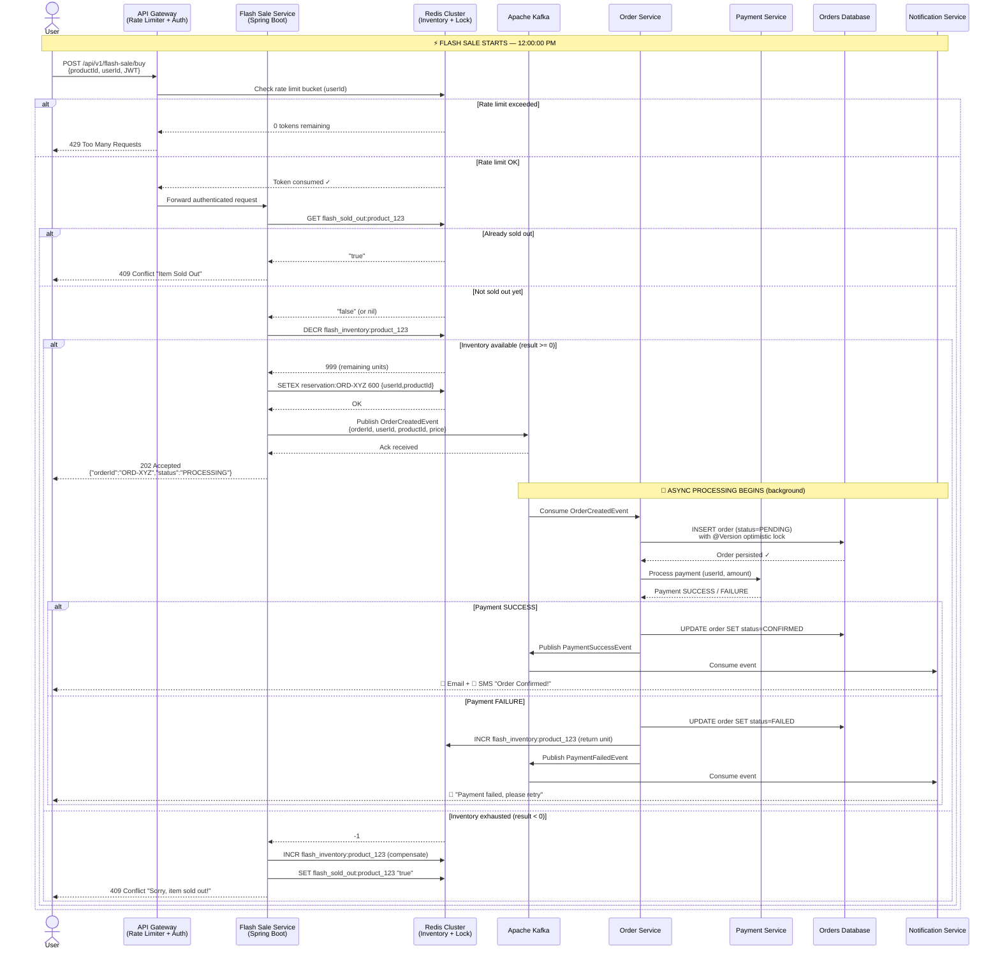

# ⚡ Flash Sale Backend: End-to-End Concurrency System Design
### *Staff Engineer / CTO Walkthrough — Flipkart-Scale Architecture*

---

## 📋 Table of Contents
1. [The Problem We're Solving](#1-the-problem-were-solving)
2. [Core Design Concepts](#2-core-design-concepts)
3. [Architecture Diagram](#3-architecture-diagram)
4. [End-to-End Request Flow](#4-end-to-end-request-flow)
5. [Sequence Diagram](#5-sequence-diagram)
6. [Java 17 + Spring Boot 3 Implementation](#6-java-17--spring-boot-3-implementation)
7. [Why Each Decision Was Made](#7-why-each-decision-was-made)
8. [What Can Go Wrong (And Our Defenses)](#8-what-can-go-wrong-and-our-defenses)

---

## 1. The Problem We're Solving

Imagine it's 12:00:00 PM. 5 million users simultaneously click **"Buy Now"** on a smartphone with only **1,000 units** in stock.

Without careful design, three catastrophes happen:
- **Overselling**: We sell 3,000 units but only have 1,000. We're cancelling orders and destroying trust.
- **System Crash**: Our database server receives 5 million writes per second and collapses.
- **Thundering Herd**: Every request hits every service simultaneously, creating a cascade of failures.

Our job is to design a system that handles all three.

---

## 2. Core Design Concepts

Think of it like a **concert ticket booth** analogy — we'll use this throughout.

### 🔴 2.1 Rate Limiting (The Bouncer at the Door)
**What it is:** A gatekeeper that limits how many requests a single user (or IP) can make per second.

**Why we need it:** Without this, a single bot can send 10,000 requests per second, starving real users.

**How it works:** We use the **Token Bucket algorithm** in Redis. Each user gets a bucket of tokens. Each request consumes one token. Tokens refill over time. Empty bucket = rejected request.

```
User sends request → Check Redis bucket → Has token? → Process → Else → 429 Too Many Requests
```

### 🟡 2.2 CDN + Caching (The FAQ Board Outside the Venue)
**What it is:** Static content (product images, descriptions, sale page) is served from a CDN edge node near the user — not from our origin servers.

**Why we need it:** 90% of the 5 million users are just *viewing* the product page. They don't need to hit our backend at all.

**Two layers:**
- **CDN (CloudFront/Akamai):** Serves static HTML, CSS, JS, images from edge nodes globally.
- **Redis Cache:** Stores dynamic data like current price, stock status (`IN_STOCK / SOLD_OUT`), so read queries never reach the database.

### 🟠 2.3 Inventory Pre-Loading into Redis (The Actual Ticket Counter)
**What it is:** Before the sale starts, we load the inventory count (e.g., `1000`) into Redis as an **atomic counter**.

**Why Redis, not the database?**
- Redis can handle **~1 million operations/second** vs MySQL's ~5,000 writes/second.
- Redis's `DECR` command is **atomic** — meaning two requests can never read the same value simultaneously. This is our single source of truth for inventory.

```
Before sale starts:   SET flash_inventory:product_123  1000
User buys:            DECR flash_inventory:product_123  → Returns 999, 998... 0
Last unit gone:       DECR returns -1 → We reject the request
```

### 🔵 2.4 Distributed Locking (One Person at the Counter at a Time)
**What it is:** A Redis-based lock (`Redisson` library) that ensures only **one process** can execute a critical section at a time across all our server instances.

**When we use it:** When we need to do a compound operation — check stock AND reserve it — atomically.

**The mechanism:** A server acquires a lock with a TTL (say 500ms). It does the work. It releases the lock. If it crashes, the TTL auto-releases the lock. No deadlocks.

> **Important:** For pure inventory decrement, Redis `DECR` alone is sufficient (it's atomic). We use distributed locking for more complex reservation flows (e.g., cart + inventory + promo code in one transaction).

### 🟣 2.5 Message Queue — Kafka (The Order Processing Back Room)
**What it is:** After we've confirmed the inventory reservation, we publish an event to **Apache Kafka** and immediately return a response to the user. The heavy work (payment processing, DB writes, notification emails) happens asynchronously.

**Why this matters:** The user doesn't wait for all that — they get a "Your order is being processed" response in milliseconds. Real order processing happens in the background without blocking the user.

```
Request → Reserve inventory (fast, Redis) → Publish to Kafka → Return "Processing" to user
                                                   ↓
                                    [Background] Consume event → Payment → DB Write → Email
```

### ⚪ 2.6 Optimistic Locking in the Database (Double-Check Before Saving)
**What it is:** When we finally write to the database, we use a `@Version` field in JPA. Before saving, it checks: "Has anyone else modified this row since I read it?" If yes, it throws `OptimisticLockException` and retries.

**Why:** This is our last line of defense — a safety net at the persistence layer to prevent any race condition that slipped through.

### ⚫ 2.7 Circuit Breaker (Emergency Shutoff Valve)
**What it is:** If a downstream service (payment gateway, inventory service) starts failing repeatedly, the circuit "opens" and we stop calling it — returning a fast fallback response. After a cooldown, it "half-opens" to test if the service is healthy again.

**Library:** Resilience4j (built into Spring Boot ecosystem).

---

## 3. Architecture Diagram



---

## 4. End-to-End Request Flow

Here is the step-by-step journey of a single user's "Buy Now" click:

### Phase 1: Edge & Gateway (< 5ms)
```
1. User clicks "Buy Now"
2. Request hits CDN → not cacheable (POST), passes through to API Gateway
3. API Gateway checks JWT token → validates user identity
4. Rate Limiter checks Redis: does this user have tokens left?
   - YES → consume 1 token, continue
   - NO  → return HTTP 429 "Too Many Requests" immediately
```

### Phase 2: Inventory Reservation (< 20ms)
```
5. Request reaches Flash Sale Service (one of N auto-scaled instances)
6. Check Redis: is item sold out? (cached flag)
   - SOLD_OUT flag = true → return HTTP 409 "Item Sold Out" immediately
7. Execute Redis DECR on inventory counter atomically:
   - Result >= 0 → Reservation successful! You got a unit.
   - Result < 0  → INCR back to 0, return HTTP 409 "Item Sold Out"
8. Store reservation in Redis with a TTL (e.g., 10 minutes to complete payment)
```

### Phase 3: Order Creation via Kafka (< 5ms additional)
```
9.  Publish OrderCreatedEvent to Kafka topic "order-created"
    {userId, productId, reservationId, timestamp, price}
10. Return HTTP 202 Accepted to user:
    {"orderId": "ORD-XYZ", "status": "PROCESSING", "message": "Hang tight!"}
    ↑ User sees this IMMEDIATELY. Job done for the hot path.
```

### Phase 4: Async Order Processing (Background, seconds later)
```
11. Order Service consumes Kafka event
12. Writes pending order to Orders DB (with optimistic locking)
13. Calls Payment Service → Payment Gateway API
14. On payment success:
    a. Update order status to CONFIRMED in DB
    b. Publish to "payment-events" topic → Inventory DB Sync consumer
    c. Inventory DB Sync decrements actual DB inventory
    d. Publish to "notifications" topic → Notification Service sends email/SMS/push
15. On payment failure:
    a. Update order status to FAILED
    b. INCR Redis inventory counter back (return the unit to the pool)
    c. Notify user of payment failure
```

---

## 5. Sequence Diagram



---

## 6. Java 17 + Spring Boot 3 Implementation

### 6.1 Project Dependencies (`pom.xml`)

```xml
<dependencies>
    <!-- Spring Boot Core -->
    <dependency>
        <groupId>org.springframework.boot</groupId>
        <artifactId>spring-boot-starter-web</artifactId>
    </dependency>

    <!-- Redis - Lettuce client (async, non-blocking) -->
    <dependency>
        <groupId>org.springframework.boot</groupId>
        <artifactId>spring-boot-starter-data-redis</artifactId>
    </dependency>

    <!-- Redisson - Distributed Locking over Redis -->
    <dependency>
        <groupId>org.redisson</groupId>
        <artifactId>redisson-spring-boot-starter</artifactId>
        <version>3.27.0</version>
    </dependency>

    <!-- Kafka Producer + Consumer -->
    <dependency>
        <groupId>org.springframework.kafka</groupId>
        <artifactId>spring-kafka</artifactId>
    </dependency>

    <!-- Resilience4j - Circuit Breaker -->
    <dependency>
        <groupId>io.github.resilience4j</groupId>
        <artifactId>resilience4j-spring-boot3</artifactId>
        <version>2.2.0</version>
    </dependency>

    <!-- JPA + Database -->
    <dependency>
        <groupId>org.springframework.boot</groupId>
        <artifactId>spring-boot-starter-data-jpa</artifactId>
    </dependency>

    <!-- Micrometer + Prometheus (Observability) -->
    <dependency>
        <groupId>io.micrometer</groupId>
        <artifactId>micrometer-registry-prometheus</artifactId>
    </dependency>
</dependencies>
```

---

### 6.2 The Flash Sale Service — Core Logic

```java
// FlashSaleService.java
@Service
@RequiredArgsConstructor
@Slf4j
public class FlashSaleService {

    private final RedisTemplate<String, String> redisTemplate;
    private final RedissonClient redissonClient;
    private final KafkaTemplate<String, OrderCreatedEvent> kafkaTemplate;
    private final OrderRepository orderRepository;

    private static final String INVENTORY_KEY = "flash_inventory:";
    private static final String SOLD_OUT_KEY  = "flash_sold_out:";
    private static final String RESERVE_KEY   = "reservation:";

    /**
     * HOT PATH — This must be blazing fast.
     * Target: < 30ms end-to-end for this method.
     */
    public PurchaseResponse purchaseItem(String productId, String userId) {

        // Step 1: Fast-fail if already sold out (O(1) Redis GET)
        String soldOutFlag = redisTemplate.opsForValue().get(SOLD_OUT_KEY + productId);
        if ("true".equals(soldOutFlag)) {
            return PurchaseResponse.soldOut();
        }

        // Step 2: Atomic inventory decrement
        Long remaining = redisTemplate.opsForValue().decrement(INVENTORY_KEY + productId);

        if (remaining == null || remaining < 0) {
            // Compensate: push the counter back up (we went below zero)
            redisTemplate.opsForValue().increment(INVENTORY_KEY + productId);

            // Set the sold-out flag so future requests fast-fail at Step 1
            redisTemplate.opsForValue().set(SOLD_OUT_KEY + productId, "true");

            return PurchaseResponse.soldOut();
        }

        // Step 3: Create a reservation with a 10-minute TTL
        String orderId = UUID.randomUUID().toString();
        redisTemplate.opsForValue().set(
            RESERVE_KEY + orderId,
            userId + ":" + productId,
            Duration.ofMinutes(10)
        );

        // Step 4: Publish to Kafka — fire and forget (async)
        OrderCreatedEvent event = new OrderCreatedEvent(orderId, userId, productId, Instant.now());
        kafkaTemplate.send("order-created", orderId, event)
            .whenComplete((result, ex) -> {
                if (ex != null) {
                    log.error("Failed to publish order event for orderId={}", orderId, ex);
                    // Compensate: return inventory unit
                    redisTemplate.opsForValue().increment(INVENTORY_KEY + productId);
                }
            });

        // Step 5: Return 202 Accepted immediately — user is done waiting!
        return PurchaseResponse.processing(orderId);
    }
}
```

---

### 6.3 The Controller

```java
// FlashSaleController.java
@RestController
@RequestMapping("/api/v1/flash-sale")
@RequiredArgsConstructor
public class FlashSaleController {

    private final FlashSaleService flashSaleService;

    @PostMapping("/buy")
    public ResponseEntity<PurchaseResponse> buy(
            @RequestBody BuyRequest request,
            @AuthenticationPrincipal JwtPrincipal principal) {

        PurchaseResponse response = flashSaleService.purchaseItem(
            request.productId(),
            principal.getUserId()
        );

        HttpStatus status = response.isSuccess()
            ? HttpStatus.ACCEPTED       // 202 — processing
            : HttpStatus.CONFLICT;      // 409 — sold out

        return ResponseEntity.status(status).body(response);
    }
}

// Immutable record — Java 17 feature
public record BuyRequest(String productId) {}
```

---

### 6.4 Redis Rate Limiter (Token Bucket)

```java
// RateLimiterFilter.java
@Component
@RequiredArgsConstructor
public class RateLimiterFilter extends OncePerRequestFilter {

    private final RedisTemplate<String, String> redisTemplate;

    // Allow 5 requests per second per user
    private static final int MAX_TOKENS      = 5;
    private static final int REFILL_INTERVAL = 1; // seconds

    @Override
    protected void doFilterInternal(HttpServletRequest req,
                                    HttpServletResponse res,
                                    FilterChain chain) throws IOException, ServletException {
        String userId = extractUserIdFromJwt(req);
        String key    = "rate_limit:" + userId;

        // Atomic Lua script: read-then-decrement safely
        Long tokens = redisTemplate.execute(RATE_LIMIT_SCRIPT,
            List.of(key),
            String.valueOf(MAX_TOKENS),
            String.valueOf(REFILL_INTERVAL));

        if (tokens != null && tokens >= 0) {
            chain.doFilter(req, res);
        } else {
            res.setStatus(HttpStatus.TOO_MANY_REQUESTS.value());
            res.getWriter().write("{\"error\": \"Rate limit exceeded. Try again shortly.\"}");
        }
    }

    // Lua script ensures atomic check-and-decrement — no race conditions
    private static final RedisScript<Long> RATE_LIMIT_SCRIPT = RedisScript.of("""
        local tokens = tonumber(redis.call('GET', KEYS[1]) or ARGV[1])
        if tokens > 0 then
            redis.call('SET', KEYS[1], tokens - 1, 'EX', ARGV[2])
            return tokens - 1
        else
            return -1
        end
        """, Long.class);
}
```

---

### 6.5 Kafka Consumer — Order Service

```java
// OrderConsumerService.java
@Service
@RequiredArgsConstructor
@Slf4j
public class OrderConsumerService {

    private final OrderRepository orderRepository;
    private final PaymentService  paymentService;
    private final RedisTemplate<String, String> redisTemplate;

    @KafkaListener(topics = "order-created", groupId = "order-service-group")
    @Transactional
    public void handleOrderCreated(OrderCreatedEvent event,
                                   Acknowledgment ack) {
        log.info("Processing order: {}", event.orderId());
        try {
            // Save to DB — JPA @Version handles optimistic locking automatically
            Order order = Order.builder()
                .id(event.orderId())
                .userId(event.userId())
                .productId(event.productId())
                .status(OrderStatus.PENDING)
                .createdAt(event.timestamp())
                .build();
            orderRepository.save(order);

            // Call payment service (wrapped in Circuit Breaker — see below)
            PaymentResult result = paymentService.processPayment(event);

            if (result.isSuccess()) {
                order.setStatus(OrderStatus.CONFIRMED);
            } else {
                order.setStatus(OrderStatus.FAILED);
                // Return the inventory unit to Redis
                redisTemplate.opsForValue()
                    .increment("flash_inventory:" + event.productId());
            }

            orderRepository.save(order);
            ack.acknowledge(); // Commit Kafka offset ONLY after successful processing

        } catch (OptimisticLockingFailureException ex) {
            // Another consumer beat us — this is a duplicate event, safe to ignore
            log.warn("Duplicate order event detected for orderId={}, ignoring.", event.orderId());
            ack.acknowledge();
        }
    }
}
```

---

### 6.6 Circuit Breaker on Payment Service

```java
// PaymentService.java
@Service
@RequiredArgsConstructor
public class PaymentService {

    private final PaymentGatewayClient gatewayClient;

    @CircuitBreaker(name = "payment-gateway", fallbackMethod = "paymentFallback")
    @Retry(name = "payment-gateway", fallbackMethod = "paymentFallback")
    public PaymentResult processPayment(OrderCreatedEvent event) {
        return gatewayClient.charge(event.userId(), event.price());
    }

    // Fallback: if payment gateway is down, queue for retry later
    public PaymentResult paymentFallback(OrderCreatedEvent event, Throwable ex) {
        log.error("Payment gateway unavailable for orderId={}. Queuing for retry.", event.orderId(), ex);
        // Publish to a retry topic — another consumer will handle it
        return PaymentResult.queued(event.orderId());
    }
}
```

---

### 6.7 JPA Entity with Optimistic Locking

```java
// Order.java
@Entity
@Table(name = "orders")
@Data
@Builder
public class Order {

    @Id
    private String id;

    @Column(nullable = false)
    private String userId;

    @Column(nullable = false)
    private String productId;

    @Enumerated(EnumType.STRING)
    private OrderStatus status;

    /**
     * @Version tells JPA: before saving this row, check that the version
     * in the DB matches what we read. If not, someone else updated it first
     * → throw OptimisticLockingFailureException.
     *
     * This is our database-level safety net against race conditions.
     */
    @Version
    private Long version;

    private Instant createdAt;
}
```

---

### 6.8 Pre-Sale Inventory Loading (Run before the sale starts)

```java
// InventoryLoader.java — Run this as a @Scheduled job 5 minutes before sale start
@Component
@RequiredArgsConstructor
public class InventoryLoader {

    private final RedisTemplate<String, String> redisTemplate;
    private final ProductRepository productRepository;

    @Scheduled(cron = "0 55 11 * * *") // 11:55 AM, 5 mins before 12 PM sale
    public void loadInventoryIntoRedis() {
        List<FlashProduct> products = productRepository.findActiveSaleProducts();

        for (FlashProduct p : products) {
            // Set inventory counter — this is the authoritative count for the sale
            redisTemplate.opsForValue()
                .set("flash_inventory:" + p.getId(), String.valueOf(p.getSaleStock()));

            // Clear any stale sold-out flag from previous sales
            redisTemplate.delete("flash_sold_out:" + p.getId());

            log.info("Loaded {} units for product {} into Redis", p.getSaleStock(), p.getId());
        }
    }
}
```

---

## 7. Why Each Decision Was Made

| Decision | Alternative Considered | Why We Chose This |
|---|---|---|
| **Redis DECR for inventory** | DB row with SELECT FOR UPDATE | Redis is 200x faster; DB would become a bottleneck at 1M req/s |
| **Kafka for order processing** | Synchronous REST calls | Decouples hot path from slow operations; prevents cascade failures |
| **Optimistic locking in JPA** | Pessimistic locking (SELECT FOR UPDATE) | Pessimistic locks hold DB connections open; horrible under high concurrency |
| **202 Accepted response** | Wait for order confirmation | User experience: users see a response in <50ms instead of waiting 2-3 seconds |
| **Lua script for rate limiter** | Java-side check-then-set | Lua is atomic in Redis; pure Java would have a TOCTOU race condition |
| **Circuit Breaker on payment** | No fallback | Prevents a slow payment gateway from cascading into a full system outage |
| **CDN for product page** | Serve from origin | 90% of requests are reads; CDN absorbs them so origin handles only BUY requests |

---

## 8. What Can Go Wrong (And Our Defenses)

### 🔥 Scenario A: Redis crashes mid-sale
**Risk:** Inventory counter is lost. We lose track of how many units were sold.
**Defense:**
- Redis Cluster with replication (at least 1 replica per shard).
- Redis AOF (Append-Only File) persistence — every write is logged to disk.
- Pre-sale: snapshot count to DB. Post-crash: reconcile Redis from DB + Kafka log.

### 🔥 Scenario B: A Kafka consumer crashes after consuming but before writing to DB
**Risk:** Order is lost — customer was charged but no order created.
**Defense:**
- Kafka manual offset commit (`Acknowledgment ack`). We only call `ack.acknowledge()` AFTER the DB write succeeds.
- If consumer crashes before acknowledging, Kafka redelivers the event to the next consumer (at-least-once delivery).
- Idempotency key (`orderId`) ensures duplicate events are safely ignored via `OptimisticLockingFailureException`.

### 🔥 Scenario C: Payment gateway is overwhelmed
**Risk:** All order processing threads are stuck waiting on payment, backing up the entire system.
**Defense:**
- Circuit Breaker opens after N consecutive failures — stops calling the gateway.
- Fallback publishes to a retry Kafka topic. Orders are processed when gateway recovers.
- Timeout on all external HTTP calls (never wait more than 3 seconds).

### 🔥 Scenario D: Race condition — two users get the last unit
**Risk:** Redis DECR is atomic, but what if there's a bug in our compensation logic?
**Defense:**
- DECR is truly atomic. Two threads will always get different values.
- Final DB write uses `@Version` — even if somehow two orders slip through, only one will persist.
- Daily reconciliation job: compare Redis final count + confirmed Kafka events vs DB rows.

---

## 🏁 Summary for the Junior Developer

Here's the one-paragraph mental model to take away:

> **Before the sale,** we park all 1,000 units in Redis (fast in-memory storage). **When the sale starts,** the API Gateway bounces bots with rate limiting and validates tokens. Each valid "Buy" request does ONE Redis operation (`DECR`) to atomically grab a unit. If it gets a unit, it fires an event into Kafka and immediately tells the user "Processing!" — the user never waits more than ~50ms. **In the background,** a consumer service picks up the event, writes to the database, charges the card, and sends a confirmation. If payment fails, the unit is returned to Redis. The database is **never** on the hot path — it only handles background, async writes. Every external call has a circuit breaker. The whole system is designed so that **no single component is a bottleneck**, and **failure of one component cannot bring down another**.

That's production-grade flash sale engineering.
